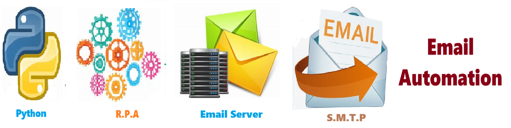

# Email Automation - Solution for Email Automation
Solution for Email Automation

Welcome to the solution **Email Automation** - an example for your projects

Solution for Email Automation
## instructions # Email automation  - automatically send any Email  

## Description

Welcome to the ** Email automation ** repository! This project demonstrates how to generate email automatically !!!   

## NOTE - THIS REPOSITORY WORK IN PROGRESS 

The are many ways to do this. It isnt perfect !!! so Experiment. Branch it and Change it. 

## Features

- Easily to understand and use  
- Easily Configurable 
- Finds your related data
- Its Pretty 

## Notebook Features

- Self Documenting 
- Self Testing 
- Easily Configurable
- Includes Talking Code - The code explains itself
- Self Logging 
- Self Debugging 
- Low Code - or - No Code
- Educational 

## Getting Started

To get started with the ** Email Automation ** project, follow these steps:

1. Clone the repository to your local machine.
2. Install the required dependencies listed at the top of the notebook.
3. Explore the example code provided in the repository and experiment.
4. Run the notebook and your find your most Critical Data - EASY !

 

## Features
- Easy to understand and use  
- Easily Configurable 
- Quickly start your project with pre-built templates
- Its Fast and Automated

## Notebook Features
- **Self Documenting** - Automatically identifes major steps in notebook 
- **Self Testing** - Unit Testing for each ptyhon function
- **Easily Configurable** -easily modifyable with config.INI name value pairs
- **Includes Talking Code** - The code explains itself.
- **Self Logging** - enhanced python standard logging   
- **Self Debugging** - enhanced python standard debugging
- **Low Code - or - No Code** - Most solutions are under 50 lines of code
- **Educational** - Includes educational dialogue and background material
    
## Getting Started
To get started with the **Email Automation** solution repository, follow these steps:
1. Clone the repository to your local machine.
2. Install the required dependencies listed at the top of the notebook.
3. Explore the example code provided in the repository and experiment.
4. Run the notebook and make it your own - **EASY !**
    
## https://github.com/JoeEberle/ -- josepheberle@outlook.com 
    

             